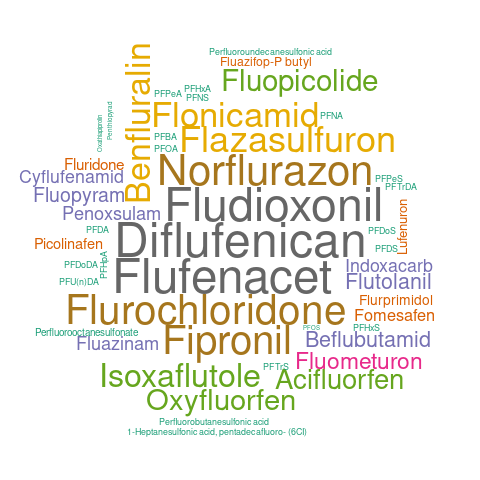

---

# Contexte
Le "Forever Pollution Project" est une enquête journalistique qui s’intéresse aux substances per-et-polyfluoroalkylées (PFAS), souvent surnommées "polluants éternels" en raison de leur extrême persistance dans l’environnement. Utilisés depuis les années 1940 pour leurs propriétés résistantes à l’eau et à la chaleur, ces composés chimiques sont aujourd’hui une source majeure de préoccupation environnementale et sanitaire. L’enquête se distingue par son approche rigoureuse, basée sur des méthodologies scientifiques reconnues et des prélèvements environnementaux étendus. Un article du journal Le Monde en date du 23 février 2023 résume cette enquête ainsi que la méthode d’analyse retenue : https://www.lemonde.fr/les-decodeurs/article/2023/02/23/polluants-eternels-explorez-la-carte-d-europe-de-la-contamination-par-les-pfas_6162942_4355770.html.

Sur le site https://pdh.cnrs.fr/fr/, le Centre National de la Recherche Scientifique
(CNRS) met à disposition, en accès libre, les données et livre plusieurs analyses.
L’objectif des TP3 et 4 est d’étudier un jeu de donnée, disponible sur ce site, relatif à
l’eau du robinet en France

---

# Exercice 1 : Analyse des données
Master 1 – BDIA
Analyse et visualisation des données
Sujet TP3
Contexte
Le "Forever Pollution Project" est une enquête journalistique qui s’intéresse aux sub-
stances per- et polyfluoroalkylées (PFAS), souvent surnommées "polluants éternels" en
raison de leur extrême persistance dans l’environnement. Utilisés depuis les années 1940
pour leurs propriétés résistantes à l’eau et à la chaleur, ces composés chimiques sont au-
jourd’hui une source majeure de préoccupation environnementale et sanitaire. L’enquête
se distingue par son approche rigoureuse, basée sur des méthodologies scientifiques re-
connues et des prélèvements environnementaux étendus. Un article du journal Le Monde
en date du 23 février 2023 résume cette enquête ainsi que la méthode d’analyse retenue :
https://www.lemonde.fr/les-decodeurs/article/2023/02/23/polluants-eternels
-explorez-la-carte-d-europe-de-la-contamination-par-les-pfas_6162942_4355770.html.
Sur le site https://pdh.cnrs.fr/fr/, le Centre National de la Recherche Scientifique
(CNRS) met à disposition, en accès libre, les données et livre plusieurs analyses.
L’objectif des TP3 et 4 est d’étudier un jeu de donnée, disponible sur ce site, relatif à
l’eau du robinet en France.
Exercice 1 : Analyse des données
Sur le site https://pdh.cnrs.fr/fr/, télécharger le jeu de données numéro 124, désigné
france_eaurob relatif à l’analyse de l’eau du robinet en France. L’objectif de cet exer-
cice est de comprendre la structure ainsi que les données de ce dataset.

```{r message = FALSE}
library(dplyr)
library(tidyr)
library(purrr)
library(jsonlite)
library(tm)
library(wordcloud)

dataset <- read.csv("data/pdh_export.csv")
```
## 1. Combien de lignes et combien de colonnes dans ce dataset ?
```{r}
msg <- sprintf('Nbr lignes : %d | Nbr colonnes : %d', nrow(dataset), ncol(dataset))
print(msg)
```
## 2. Afficher le nom des colonnes.
```{r}
column_name <- names(dataset)
print(column_name)
```
## 3. Afficher la première ligne du dataset.
```{r}
first_row <- head(dataset)
print(first_row)
```
## 4. Vérifier que les données concernent uniquement la France.
```{r}
onlyFrenchData <- unique(dataset$country == "France") && length(unique(dataset$country) == 1)
print(onlyFrenchData)
```
## 5. Les prélèvements concernent combien de villes différentes ?
```{r}
nbrUniqueCity <- length(unique(dataset$city))
print(nbrUniqueCity)
```
## 6. Est-ce que des prélèvements sont réalisés à Dijon, si oui combien ?
```{r}
nbrDijonData <- sum(dataset$city == "DIJON")
print(nbrDijonData)
```
## 7. En étudiant *matrix*, préciser les différentes sources de prélèvement et indiquer le nombre de prélèvements par sources.
```{r}
repartition <- dataset %>% group_by(matrix) %>% summarise(n())
print(repartition)
```
## 8. Quelle est la période couverte par les prélèvements ?
```{r}
periode <- dataset %>%
  arrange(date) %>%
  summarise(Debut = first(date), Fin = last(date))
print(periode)
```
## 9. Indiquer le nombre de prélèvement par an.
```{r}
prelevementParAn <- dataset %>%
  group_by(year) %>%
  summarise('Nombre de prélèvement' = n()) %>%
  rename('Année' = year)
print(prelevementParAn)
```
## 10. Citer les 5 villes dans lesquelles on a réalisé le plus de prélèvement.
```{r}
topFiveCity <- dataset %>%
  count(city, sort = TRUE) %>%
  slice(1:5)
print(topFiveCity)
```

---

# Exercice 2 : Statistiques selon les 5 sources de prélèvement
## 1. Pour chacune de ces 5 sources de prélèvement, calculer la moyenne, la médiane et l’écart type des PFAS *pfas_sum*
```{r}
prelevementStat <- dataset %>%
  group_by(matrix) %>%
  summarise(
    Moyenne = mean(pfas_sum, na.rm = TRUE),
    Mediane = median(pfas_sum, na.rm = TRUE),
    EcartType = sd(pfas_sum, na.rm = TRUE)
  )
print(prelevementStat)
```
## 2. Quelles sont les sources de prélèvement pour Dijon ?
```{r}
sourceInDijon <- dataset %>%
  filter(city == "DIJON") %>%
  pull(matrix) %>%
  unique()
print(sourceInDijon)
```
## 3. Les prélèvements "Sea water" concernent quelles villes ?
```{r}
seawaterCity <- dataset %>%
        filter(matrix == "Sea water") %>%
        pull(city) %>%
        unique()
print(seawaterCity)
```

---

# Exercice 3 : Qualité des données
L’objectif de cet exercice est double. D’une part, il s’agit de nettoyer les données. D’autre part, il s’agit de réduire le dataset aux informations pertinentes et de supprimer toutes les autres, notamment celles liées au contexte de l’étude. Par exemple, toutes les lignes du dataset comporte la valeur 124 dans le champs dataset_id. Cette information liée au contexte de l’étude n’apporte pas d’information pertinente dans l’analyse des données. Les fonctions suivantes vous permettront de répondre aux questions de cet exercice

## 1. Les noms de ville *city* doivent être en majuscules
```{r}
dataset$city <- toupper(dataset$city)
```
## 2. Y a-t-il des valeurs manquantes dans certains colonnes ?
```{r}
nbrMiss <- sapply(dataset, function(x) sum(is.na(x)))
print(nbrMiss)
```
## 3. Quels sont les types de données présents dans chaque colonne ?
```{r}
typeDataColumn <- sapply(dataset, typeof)
print(typeDataColumn)
```
## 4. D’où proviennent les relevés *source_text* ?
```{r}
typeSource <- unique(dataset$source_text)
print(typeSource)
```
## 5. Quelles colonnes comportent des valeurs uniques comme par ex. *dataset_id* ?
```{r}
uniqueValueColumn <- names(dataset)[sapply(dataset, function(x) length(unique(x)) == 1)]
print(uniqueValueColumn)
```
## 6. En fonction des réponses obtenues aux questions précédentes, supprimer toutes les colonnes qui ne vous paraissent pas indispensables et sauvegarder votre nouveau dataset dans **data2**. Poursuivre les exercices avec **data2**.
```{r}

```

---

# Exercice 4 : Exploitation des données au format json
Le champ *pfas_values* contient les données suivantes sous forme de listes au format JSON.
• cas_id : identifiant unique de la substance (CAS).
• unit : unité de mesure.
• substance : nom de la substance mesurée.
• isomer : information sur l’isomère.
• less_than : limite de détection.
• value : valeur mesurée

## 1. Convertir *pfas_values* pour l’exploiter en R
```{r}
# Parser les données JSON de la colonne pfas_values
pfasValues <- lapply(dataset$pfas_values, fromJSON)
# Convertir la liste en data frame
pfasValues_df <- bind_rows(pfasValues)
```
## 2. Lister et compter les différentes substances présentes.
```{r}
substances <- pfasValues_df %>%
         group_by(substance) %>%
        summarise(n())
print(substances)

```
## 3. Lister les 5 substances les plus fréquentes.
```{r}
topFiveSubstances <- pfasValues_df %>%
        count(substance, sort = TRUE) %>%
        slice(1:5)
print(topFiveSubstances)
```
## 4. Les substances PFOS, PFOA, PFDA et PFNA sont elles présentes, si oui, à quelle fréquence ?
```{r}
fourSubstances <- pfasValues_df %>%
        filter(substance %in% c("PFOS","PFOA","PFDA","PFNA")) %>%
        group_by(substance) %>%
        summarise(frequence = n())
print(fourSubstances)
```

---

# Exercice 5 : Analyse des prélèvements de Dijon
L’objectif de cet exercice est d’étudier les substances prélevées à Dijon et d’établir un classement des villes.

## 1. Quelles sont les substances (*substance*) détectées à Dijon, leurs valeurs ? qu’en déduisez-vous ?
```{r}
# Parser les données JSON de la colonne pfas_values pour Dijon
pfasValuesDijon <- dataset %>%
        filter(city == "DIJON") %>%
        pull(pfas_values) %>%
        lapply(fromJSON)

# Convertir la liste en data frame
pfasValuesDijon_df <- bind_rows(pfasValuesDijon)

substancesDijon <- pfasValuesDijon_df %>%
        filter(!is.na(value)) %>%
        select(substance, value)

print(substancesDijon)
```
## 2. Etablir un classement des villes par ordre décroissant sur pfas_sum. Le classement prend en compte que les villes dont la somme est supérieure à 1.
```{r}
cityPfasSumRank <- dataset %>%
        filter(pfas_sum > 1) %>%
        arrange(desc(pfas_sum)) %>%
        select(city, pfas_sum)
head(cityPfasSumRank, 10)
```
# Exercice 6 : Graphique "nuage de mots" (word cloud)
L’objectif de cet exercice est de réaliser un graphique "nuage de mots" afin de mettre en évidence le nom des substances (voir Exercice 4, question 2).
```{r}
set.seed(123456)  # permet de "fixer un graine" pour l'alea, afin de pouvoir regenerer plusieurs fois le meme wordcloud

substancesFiltered <- substances %>%
        filter("n()" > 3) %>%
        arrange(desc("n()")) %>%
        head(50)

png("./data/wordcloud.png")
wordcloud(
        words = substancesFiltered$substance,
        freq = substancesFiltered$`n()`,
        colors = brewer.pal(8, "Dark2"),
        random.order=FALSE,
)
dev.off()

```